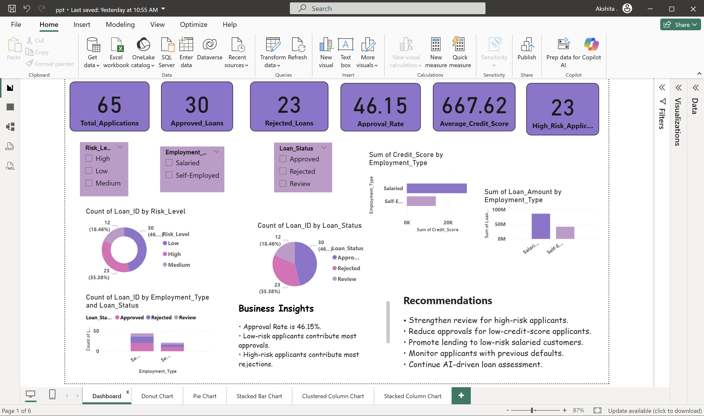

# Power BI Dashboard

## Objective

To visualize loan approval data and generate actionable business insights.

---

## Dashboard KPIs

- Total Applications
- Approved Loans
- Rejected Loans
- Approval Rate
- Average Credit Score
- High Risk Applicants

---

## Dashboard Features

### Risk Analysis
- Low Risk Applicants
- Medium Risk Applicants
- High Risk Applicants

### Loan Status Analysis
- Approved
- Rejected
- Review

### Employment Analysis
- Salaried Applicants
- Self-Employed Applicants

### Business Insights
- Approval trends
- Risk distribution
- Loan performance metrics

### Recommendations
- Improve high-risk applicant screening
- Promote low-risk lending
- Monitor credit behavior

---

## Power BI Dashboard Screenshot

---

# Key Skills Demonstrated

- Workflow Automation
- Power BI Dashboarding
- Financial Analysis
- Business Intelligence
- Google Sheets Automation
- Email Automation
- Risk Assessment
- Data Visualization

---

# Business Impact

- Reduced manual loan processing effort
- Faster approval decisions
- Improved customer communication
- Enhanced financial guidance accessibility
- Better data-driven decision making
- Real-time reporting and monitoring

---

# Author

*Akshita Modi*

MBA Finance

AI, Automation, Analytics & Business Intelligence Projects

GitHub Repository:
https://github.com/modiakshita37-debug/Loan-approval-automation

---
